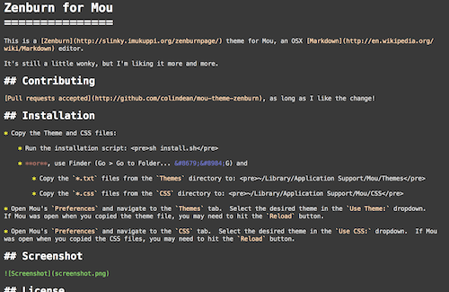

Zenburn for Mou
===============

This is a [Zenburn](http://slinky.imukuppi.org/zenburnpage/) theme for Mou, an OSX [Markdown](http://en.wikipedia.org/wiki/Markdown) editor.

It's still a little wonky, but I'm liking it more and more. 

## Contributing

[Pull requests accepted](http://github.com/colindean/mou-theme-zenburn), as long as I like the change!

## Installation

* Copy the Theme and CSS files:

	* Run the installation script: <pre>sh install.sh</pre>

	* **or**, use Finder (Go > Go to Folder... &#8679;&#8984;G) and

		* Copy the `*.txt` files from the `Themes` directory to: <pre>~/Library/Application Support/Mou/Themes</pre>

		* Copy the `*.css` files from the `CSS` directory to: <pre>~/Library/Application Support/Mou/CSS</pre>

* Open Mou's `Preferences` and navigate to the `Themes` tab.  Select the desired theme in the `Use Theme:` dropdown.  If Mou was open when you copied the theme file, you may need to hit the `Reload` button.

* Open Mou's `Preferences` and navigate to the `CSS` tab.  Select the desired theme in the `Use CSS:` dropdown.  If Mou was open when you copied the CSS files, you may need to hit the `Reload` button.

## Screenshot

## License

GNU GPL, just like the [original Zenburn](http://slinky.imukuppi.org/zenburnpage/).